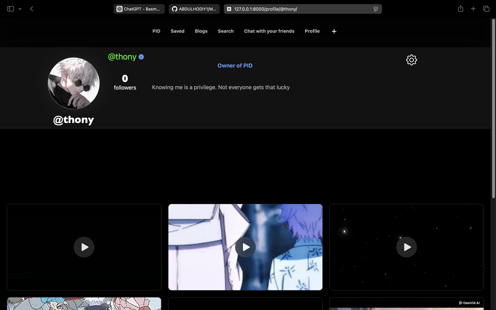
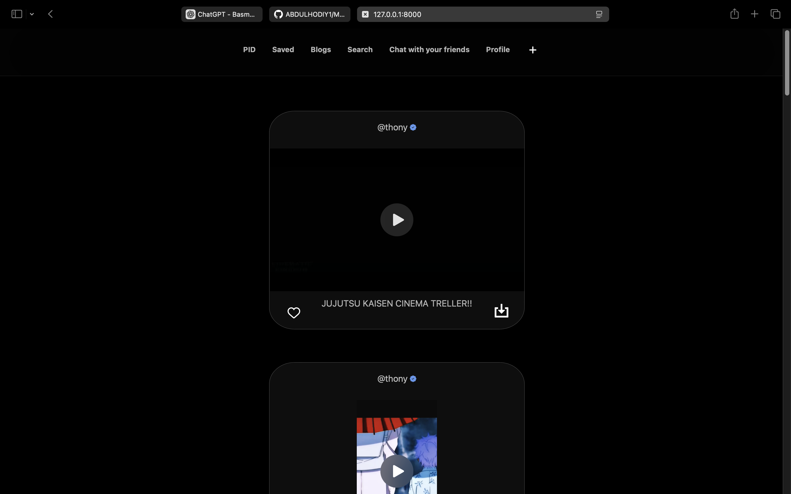
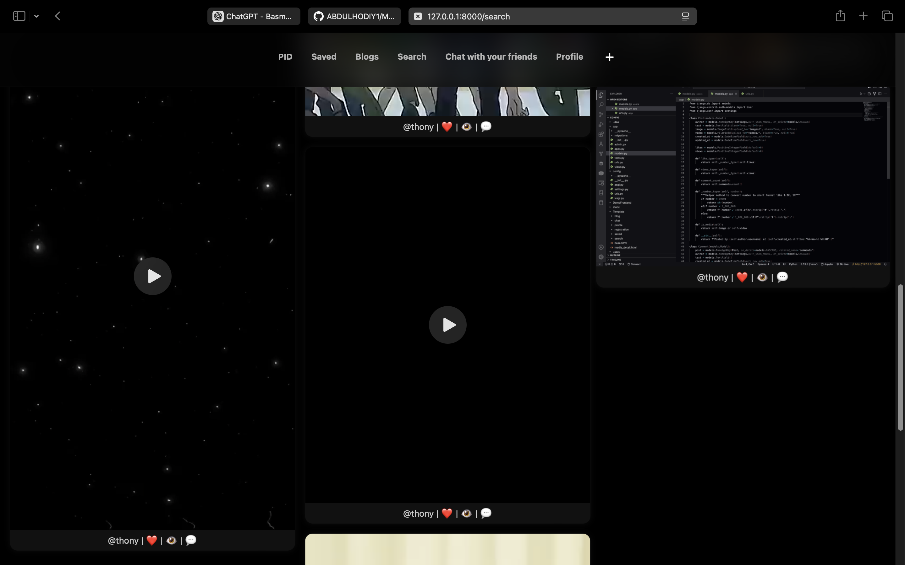

# PID - Social Media Platform

**PID.com** — bu zamonaviy qora fonli  interfeysiga ega media kontent almashish va dostlar bilan muloqot qilish imkonini beradigan ijtimoiy tarmoq platformasi Foydalanuvchilar video blog va rasm shaklidagi postlar joylashi izohlashi va saqlab qoyishi mumkin

##  Korinishlari

| Profil Sahifasi | Postlar | Qidiruv Sahifasi |
| --------------- | ------- | ---------------- |
|  |  |  |

## Asosiy Funksiyalar

- **Profil sahifasi** — foydalanuvchi haqida malumot avatar bio va joylashtirilgan postlar
- **Video postlar** — foydalanuvchilar video yuklashi va korishi mumkin
- **Like va Saqlash** — yoqqan postlarga like bosish yoki keyinroq korish uchun saqlash imkoniyati
- **Bloglar bo‘limi** — foydalanuvchilar oz maqolalarini yozib ulashishlari mumkin
- **Qidiruv** — boshqa foydalanuvchilar va postlarni topish
- **Dostlar bilan chat** — real vaqtli muloqot qilish imkoniyati
- **Dark Mode UI** — zamonaviy va qulay interfeys

## 🛠 Texnologiyalar

- **Frontend**: HTML, CSS (Dark Mode dizayn) JavaScript
- **Backend**: Python (Django)
- **Ma’lumotlar bazasi**: SQLite (Xozircha!)
- **Video Player**: HTML5 video player integratsiyasi

## 🚀 Ornatish

1. Loyihani klon qiling:
```bash
   git clone https://github.com/username/pid.git
   cd pid
```
```commandline
   python -m venv venv
   source venv/bin/activate   # Mac/Linux
   venv\Scripts\activate      # Windows
```
```commandline
pip install -r requirements.txt 
```
```commandline
python manage.py migrate
```

```commandline
python manage.py runserver
```


# Media-with-django
# Media-with-django
# Media-with-django
# Media-with-django
# Media-with-django
